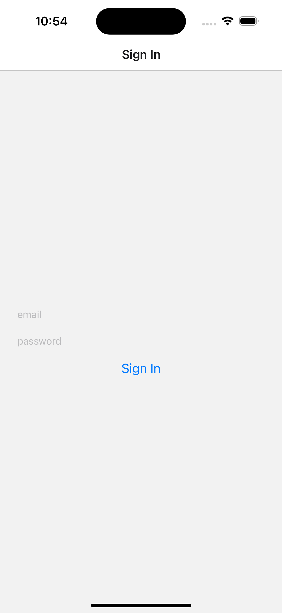

# Technical Challenge

This repo contains a basic react-native app with 3 screens:

- Sign in
- Companies List
- Company Details

To get the project up and running, you will need to run `yarn` and `npx pod-install` (for iOS). You should then be able to run `yarn start` followed by `yarn ios` for iOS or `yarn android` for Android, assuming you have followed the instructions in the [react native documentation](https://reactnative.dev/docs/environment-setup). 

Once you have the project up and running, you should see some further instructions in each screen in addition to what's in this ReadMe.

## Acceptance criteria

You will need to build out the app with some very basic functionality. All of the endpoints and details you need can be found in the `config.ts` file.

A user should not be able to see the list and details screens without first signing in. You will need to manage the auth state globally and render screens conditionally based on whether the user is signed in, storing the API token in global state.

The data for the list screen comes from a REST API endpoint, and the data for the details screen comes from a GraphQL endpoint. We recommend using the packages that we have pre-installed to fetch the data ([axios](https://axios-http.com/docs/intro) and [graphql-request](https://github.com/jasonkuhrt/graphql-request)), but this is not a requirement.

Once logged in, you should be able to press on a company from your list screen and see the details on the next screen.

You can choose how you wish to display the data - don't worry if design is not your strong point, you won't be judged on that! A logo and a title will do, as long as is reasonably intuitive for the user.

Once you have got the basic functionality up and running (you should not need to spend long on this), the rest of it is up to you. You can have a bit of fun with it and demonstrate some of your skills.

Here are some ideas for extra stuff you could add:

- Unit tests
- Animations
- Basic E2E tests
- Deep linking

Basically anything, the important thing is not to spend too long on it and remember you will be going through your code with the Seedrs engineers so you will need to be able to explain what you did and why. So it's not a good idea to copy and paste code you don't understand!

Once you have finished, please push your code to your own GitHub repo (make it public please) so we can take a look. Once we've taken a look, we will ask you to remove the public repo (just so other candidates won't be able to find your code!), but please do keep your code locally as we will want to go through it with you during your interview.

Good luck and we look forward to seeing what you come up with!

## Troubleshooting

This project uses the latest version of react native, so if you are struggling to get the project to build, make sure you have followed all of the instructions in the [react native documentation](https://reactnative.dev/docs/environment-setup).

If you have trouble building on iOS via the cli, you may want to try building with XCode instead.